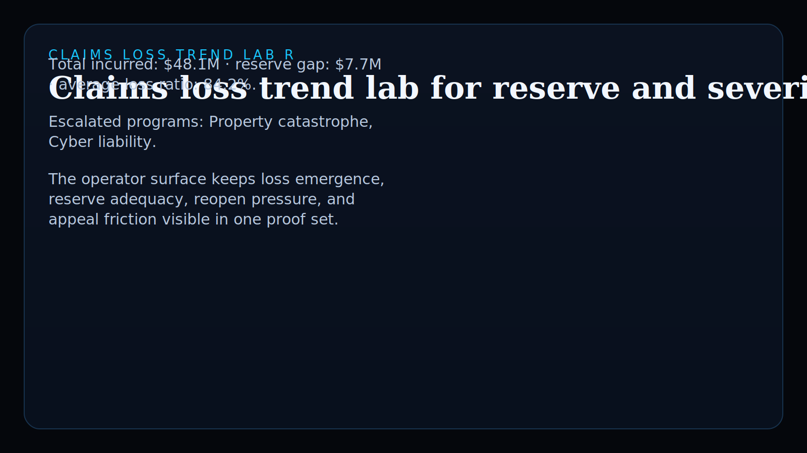
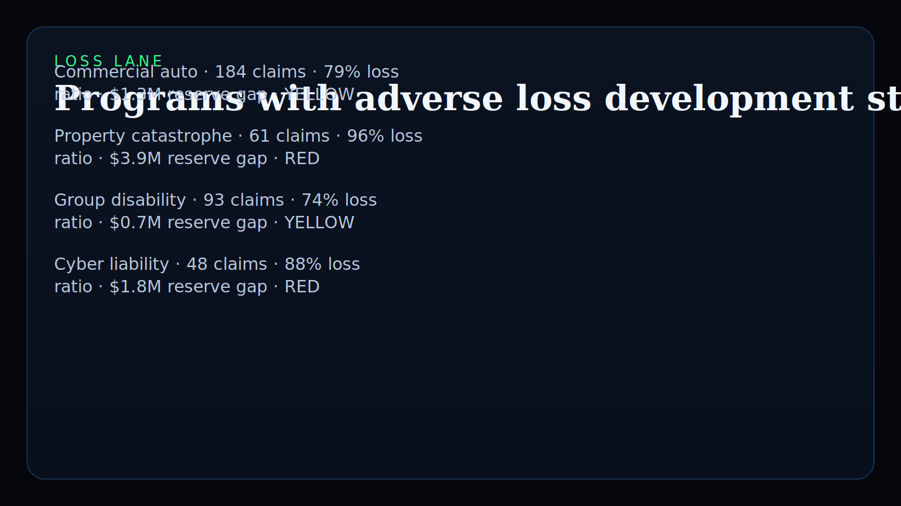
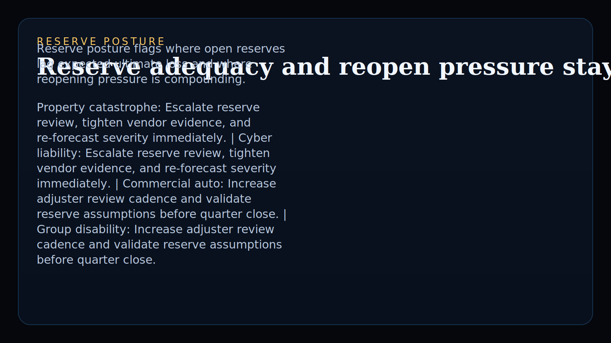
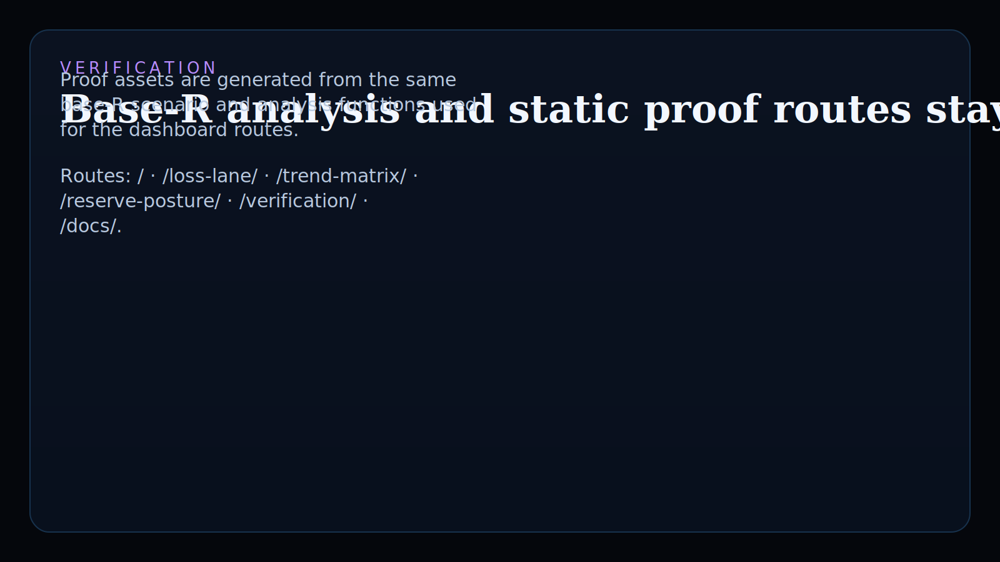

# claims-loss-trend-lab-r

Base-R operator surface for Insurance / InsurTech teams reviewing claims trend drift, reserve adequacy, reopen pressure, and buyer-readable quarter-close posture.

## What it shows

- real `R` added to the public Kinetic Gain language atlas
- an insurance vertical proof that is statistical, not just dashboard-wrapped
- monetizable reserve review, carrier packet, and claims-evidence consulting hooks

## Screenshots






## Routes

- `/`
- `/loss-lane/`
- `/trend-matrix/`
- `/reserve-posture/`
- `/verification/`
- `/docs/`

## Local development

```powershell
& 'C:\Program Files\R\R-4.6.0\bin\Rscript.exe' scripts\run_demo.R
& 'C:\Program Files\R\R-4.6.0\bin\Rscript.exe' scripts\generate_site.R
```

## Validation

```powershell
& 'C:\Program Files\R\R-4.6.0\bin\Rscript.exe' test\runtests.R
& 'C:\Program Files\R\R-4.6.0\bin\Rscript.exe' scripts\smoke_check.R
& 'C:\Program Files\R\R-4.6.0\bin\Rscript.exe' scripts\render_readme_assets.R
```

## Why this matters

Kinetic Gain Embedded tie-back:

This repo proves Kinetic Gain can ship statistical insurance operator surfaces in `R`, not just generic BI wrappers. The same base-R analysis drives reserve-review routes, trend matrices, smoke checks, and proof assets, which makes the language-atlas signal real.

## Product depth

This surface is meant for claims, actuarial, finance, and insurance operations leaders who need to explain loss movement without forcing executives to interpret raw triangles, reserve memos, or disconnected BI exports. It shows where reserve gaps, reopen pressure, severity movement, and appeals friction are already creating quarter-close risk.

For technical reviewers, the public proof is reproducible. One base-R analysis path produces the loss lane, trend matrix, reserve posture, sitemap, README proof assets, and smoke-testable HTML.

For GTM and diligence use, the repo can ladder into carrier packet templates, reserve review decks, adverse-development diagnostics, MGA review workflows, and embedded evidence-routing work for insurance teams.

## What these repos have in common

Kinetic Gain repos use the same operating pattern: name the risk, attach an owner-readable evidence view, expose the next action, and keep public proof close enough to implementation that the claim can be inspected.

This repo applies that pattern to insurance loss and reserve posture. The broader portfolio applies it to payments, KYC, grants, CAPA, diagnostics, donor cohorts, care variation, cloud, identity, and revenue systems, but the product shape is consistent: turn messy operating complexity into a board-ready and operator-usable control plane.

## Operating workflow

1. Load synthetic claims, reserve, severity, reopen, and appeals data.
2. Compare prior-quarter and current-quarter loss ratios.
3. Estimate reserve gaps against expected ultimate loss.
4. Score each program for red/yellow/green operating posture.
5. Generate program-level review guidance and reserve actions.
6. Render static buyer-facing routes and README proof assets from the same analysis.
7. Validate with tests and smoke checks before release.

## Commercial path

- `Paid templates now`
- `Consulting hook`

This can ladder into carrier packet templates, reserve review decks, adverse development diagnostics, and embedded claims-evidence work for insurers, MGAs, and broker operations teams.

---

Part of the [Kinetic Gain operator portfolio](https://kineticgain.com/) · docs: [suite.kineticgain.com](https://suite.kineticgain.com/) · live: [loss.kineticgain.com](https://loss.kineticgain.com/)
